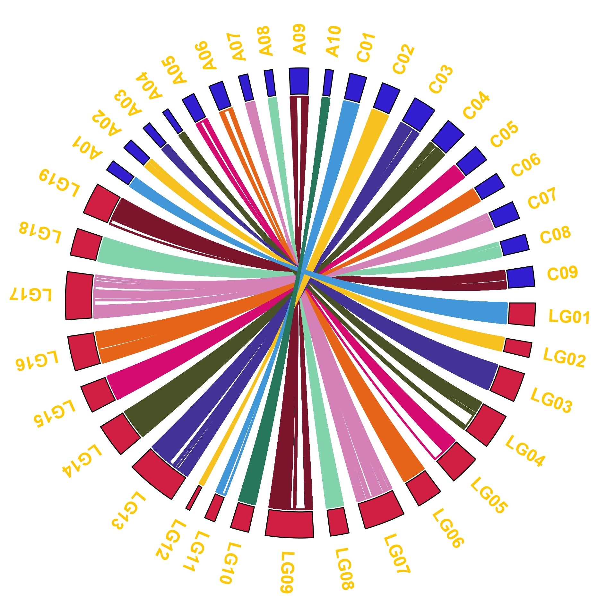

## 前言

植物的分子遗传研究的重要优势在于遗传群体的易得性。通过设计杂交混合不同来源亲本的基因组，自交获得一系列基因型和表型存在分离的作图群体。

双亲群体经历的连续世代较少，连锁不平衡衰减较大，即重组事件少，重组片段大。重测序会产生全基因组接近饱和的变异，但二代测序易产生错误，导致错误分型，且相邻的SNP紧密连锁，不适用于关联分析和连锁分析。BIN是染色体上连续的不发生的片段，校正了错误分型，降低了计算消耗，是双亲群体重测序的常用手段。

## 数据准备

### founder多态性变异筛选

+ 初过滤标准为PASS，二等位，无缺失，次等位频率为50%，测序深度为平均测序深度的一半至两倍

```shell
vcftools --vcf pop.snp.filt.vcf.gz
--remove-filtered-all
--max-alleles 2 
--min-alleles 2 
--max-missing 1
--maf 0.4
--max-maf 0.6
--indv founderA
--indv founderB
--max-meanDP 120
--min-meanDP 30
--recode 
--out founder
```

+ 多态性变异筛选，去除存在杂合的变异

```shell
grep -v "0/1" founder.recode.vcf|awk '{print$1"\t"$2}'|grep -v "#" > founder.pos
```

+ SNPable筛选高质量位点

```shell
apply_mask_l mask_35_50.fa founder.pos > foundermask.pos
```

### offspring高质量变异鉴定

+ 初过滤标准为缺失率，maf和founder高质量位点

```shell
vcftools
--gzvcf pop.snp.filt.vcf.gz
--max-missing 0.8
--maf 0.05
--positions foundermask.pos
--recode
--out offspring_poly
```

+ 分割染色体

```shell
vcftools
--vcf offspring_poly.recode.vcf
--chr Chr1
--recode
--out Chr1
```

## BIN型重建

+ vcf转换为SNPbinner输入文件

```r
suppressMessages(library(vcfR))
suppressMessages(library(tidyverse))
suppressMessages(library(optparse))

option_list <- list(
  make_option(c("-i", "--input"), type = "character", default = FALSE,
              action = "store", help = "This is input vcf!"),
  make_option(c("-o", "--out"), type = "character", default = FALSE,
              action = "store", help = "This is output file!"),
  make_option(c("-a", "--founderA"), type = "character", default = FALSE,
              action = "store", help = "This is founder A!"),
  make_option(c("-b", "--founderB"), type = "character", default = FALSE,
              action = "store", help = "This is founder B!")
)

opt = parse_args(OptionParser(option_list = option_list, usage = "This Script is for trans vcf to tsv!"))

vcf <- read.vcfR(opt$input)

geno <- vcf %>%
  extract.gt() %>%
  as_tibble(rownames = NA) %>%
  rownames_to_column(var = "markername") %>%
  mutate(across(.cols = -markername,
                ~ str_replace_all(., pattern = "\\|", replacement = "\\/"))) %>%
  rename(founderA = !!sym(opt$founderA),
         founderB = !!sym(opt$founderB)) %>%
  mutate(across(.cols = -markername,
                ~ dplyr::case_when(
                  . == founderA ~ "a",
                  . == founderB ~ "b",
                  . == "0/1" ~ "h",
                  TRUE ~ "-"
                ))) %>%
  mutate(chrom = sapply(str_split(markername, "_"), `[`, 1) %>% str_replace(pattern = "scaffold", replacement = ""),
         position = sapply(str_split(markername, "_"), `[`, 2)) %>%
  select(markername, chrom, position, founderA, founderB, everything())

write_tsv(geno, file = opt$out)
```
```shell
Rscript vcf2tsv.r -i Chr1.recode.vcf -a founderA -b founderB -o Chr1.tsv
```

+ snp to bin

```shell
singularity exec -e ~/Singularity_lib/python2.sif python2.7 
~/software/SNPbinner/snpbinner crosspoints 
-i Chr1.tsv 
-o Chr1-crosspoints 
-r 0.02 
-l 38004428
singularity exec -e ~/Singularity_lib/python2.sif python2.7 
~/software/SNPbinner/snpbinner bins 
-i Chr1-crosspoints 
-o Chr1-bin 
-l 5000
```

+ bin型合并

```r
library(tidyverse)

file <- fs::dir_ls(path = "../../project/Bipgenetic/Rape/Data/bin/")

tmp <- map_dfr(.x = file,
               .f = ~ read.csv(., header = FALSE) %>%
                 pivot_longer(cols = -V1) %>%
                 pivot_wider(names_from = V1,
                             values_from = value) %>%
                 select(-name),
               .id = "Chrtmp") %>%
  mutate(chrom = str_sub(Chrtmp, start = -10, end = -5),
         markername = str_c(chrom, bin_start, sep = "_")) %>%
  select(markername, chrom, everything(), -Chrtmp)
```

## 遗传作图

### 全基因组BIN图

#### 单家系全基因组BIN图

```{r bip_indv_bin}
suppressWarnings(suppressMessages(library(tidyverse)))
suppressWarnings(suppressMessages(library(qtl)))
suppressWarnings(suppressMessages(library(data.table)))
suppressWarnings(suppressMessages(library(ggprism)))

path <- "C:/Users/wpf/Desktop/project/Bipgenetic/"

geno <- readxl::read_excel(path = str_c(path, "Rape/Output/geno.xlsx")) %>%
  as_tibble() %>%
  mutate(across(.cols = -c(markername, chrom, starts_with("bin")),
                ~ case_when(
                  . == 0 ~ "AA",
                  . == 2 ~ "BB",
                  . == 1 ~ "AB"
                )))

prefix <- geno %>%
  select(markername, chrom, starts_with("bin"))

tmp <- geno %>%
  select(-c(markername, chrom, starts_with("bin")))

tmp <- names(geno)[-c(1:5)] %>%
  map_dfc( ~ geno %>%
             select(all_of(.x)) %>%
             separate(col  = .x,
                      into = str_c(.x, c("_HapA", "_HapB")),
                      sep = 1)) %>%
  bind_cols(prefix) %>%
  pivot_longer(cols = -c(markername, chrom, starts_with("bin")),
               names_to = c("taxa", "Hap"),
               names_sep = "_",
               values_to = "geno")
  
genome <- tmp %>%
  group_by(chrom, Hap) %>%
  summarise(len = max(bin_end)) %>%
  ungroup() %>%
  mutate(chr = sort(rep(seq(1, 19), 2)))

tmp %>%
  left_join(genome, by = c("chrom", "Hap")) %>%
  filter(taxa %in% c(0, 1)) %>% #作图示例
  group_nest(taxa) %>%
  mutate(plot = map(data, ~ ggplot() +
                      geom_bar(data = genome,
                               mapping = aes(x = chr, y = len/1e6, group = Hap),
                               colour = "white",
                               stat = "identity",
                               fill = "white",
                               width = 0.4,
                               position = position_dodge2(width = 0.5)) +
                      scale_x_discrete(limits = unique(genome$chrom),
                                       position = "top") + 
                      scale_y_continuous(breaks = seq(0, 80, 10),
                                         trans = "reverse",
                                         expand = expansion(mult = c(0.05, 0))) +
                      theme_bw() +
                      theme(legend.position = c(0.8, 0.2),
                            plot.background = element_blank() ,
                            panel.grid.major = element_blank(),
                            panel.grid.minor = element_blank() ,
                            panel.border = element_blank(), 
                            axis.ticks.x = element_blank(),
                            axis.line.y = element_line()) +
                      xlab(NULL) + ylab("Loction (Mb)") +
                      geom_rect(data = .x,
                                mapping = aes(xmin = chr - 0.23,
                                              xmax = chr + 0.23,
                                              ymin = bin_start/1e6,
                                              ymax = bin_end/1e6,
                                              fill = geno,
                                              group = Hap),
                                position = position_dodge(width = 0.6)) +
                      scale_fill_manual(values = c("#4197d8", "#f8c120"),
                                        name = "Genotype"))) %>%
  walk2(.x = .$taxa,
        .y = .$plot,
        .f = ~ print(.y))
```

#### 群体全基因组BIN图

```{r bip_pop_bin}
geno <- readxl::read_excel(path = str_c(path, "Rape/Output/geno.xlsx")) %>%
  select(-markername, -bin_center, -B409, -`375`) %>%
  pivot_longer(cols = -c(chrom, starts_with("bin")),
               names_to = "taxa", 
               values_to = "geno") %>%
  mutate(ind = as.numeric(taxa),
         indd = ind + 1)

bin <- geno %>%
  group_by(chrom) %>%
  summarise(pos = max(bin_end)) %>%
  mutate(poscum = cumsum(lag(pos, default = 0)),
         add =  4e6,
         addcum = cumsum(lag(add, default = 0)),
         cum = poscum + addcum) %>%
  select(chrom, cum)

tmp <- geno %>%
  left_join(bin, by = "chrom") %>%
  mutate(start = bin_start + cum,
         end = bin_end + cum)

axis <- tmp %>%
  group_by(chrom) %>%
  summarise(center = mean(end))

ggplot(data = tmp) +
  geom_rect(mapping = aes(xmin = ind,
                          xmax = indd,
                          ymin = start/1e6,
                          ymax = end/1e6,
                          fill = geno)) +
  scale_y_continuous(breaks = axis$center/1e6, labels = axis$chrom) +
  scale_x_continuous(expand = expansion(mult = c(-0.05, 0))) +
  scale_fill_manual(values = c("#4197d8","grey60","#f8c120")) +
  theme_bw() +
  theme(legend.position = "none",
        panel.grid.major = element_blank(),
        panel.grid.minor = element_blank(),
        panel.border = element_blank(),
        axis.ticks = element_blank(),
        axis.text.x = element_blank()) +
  xlab(NULL) + ylab(NULL)
```

### 遗传连锁图

利用QTL IciMapping软件计算遗传距离，构建遗传连锁图谱。

+ 遗传连锁图

```{r bip_genetic_map}
map <- readxl::read_excel(path = str_c(path, "Rape/Output/map.xlsx")) %>%
  mutate(chrom = sapply(str_split(markername, "_"), `[`, 1)) %>%
  select(markername, chrom, pos) %>%
  column_to_rownames(var = "markername") %>%
  table2map()

plot.map(map)
```

+ 共线性点图

```{r bip_synteny_dot}
tmp <- map2table(map) %>%
  rownames_to_column(var = "markername") %>%
  mutate(position = sapply(str_split(markername, "_"), `[`, 2))

genetic <- tmp %>%
  group_by(chr) %>%
  summarise(gpos = max(pos)) %>%
  mutate(gposcum = cumsum(lag(gpos, default = 0))) %>%
  select(chr, gposcum)

physic <- tmp %>%
  group_by(chr) %>%
  summarise(ppos = max(as.numeric(position))) %>%
  mutate(pposcum = cumsum(lag(ppos, default = 0))) %>%
  select(chr, pposcum)

tmp2 <- tmp %>%
  left_join(genetic, by = "chr") %>%
  left_join(physic, by = "chr") %>%
  mutate(ppos = as.numeric(position) + pposcum,
         gpos = pos + gposcum)


axis <- tmp2 %>%
  group_by(chr) %>%
  summarise(xcenter = mean(gpos),
            ycenter = mean(ppos)/1e6)

ggplot(data = tmp2, aes(x = gpos, y = ppos/1e6, colour = chr)) +
  geom_point() +
  scale_x_continuous(breaks = axis$xcenter, labels = axis$chr) +
  scale_y_continuous(breaks = axis$ycenter, labels = axis$chr) +
  theme_prism() +
  scale_color_manual(values = rep(c("#4197d8", "#f8c120", "#413496", "#495226", "#d60b6f", "#e66519", "#d581b7", "#83d3ad", "#7c162c", "#26755d"), 12)) +
  theme(legend.position = "none",
        axis.ticks = element_blank(),
        axis.text.x = element_text(angle = 45, vjust = 0.6)) +
  xlab("linkage Group") + ylab("Genome")
```

+ 共线性圈图

使用Tbtools,利用R处理出输入文件

```{r bip_synteny_circos, eval = FALSE}
map <- readxl::read_excel(path = str_c(path, "Rape/Output/map.xlsx")) %>%
  mutate(chrom = sapply(str_split(markername, "_"), `[`, 1)) %>%
  select(markername, chrom, pos)

genetic <- map %>%
  group_by(chrom) %>%
  summarise(len = max(pos) * 1e6) %>%
  mutate(chrom = str_c("LG", str_pad(row_number(), width = 2, pad = 0)),
         rgb = "210,31,67") %>%
  select(chrom, len ,rgb)
physic <- map %>%
  mutate(pos = sapply(str_split(markername, "_"), `[`, 2) %>% as.numeric()) %>%
  group_by(chrom) %>%
  summarise(len = max(pos),
            rgb = "51,31,209")

genetic %>%
  bind_rows(physic) %>%
  write_tsv(., file = str_c(path, "Rape/Output/Chrlen.tsv"), col_names = FALSE)

bin <- readxl::read_excel(path = str_c(path,"Rape/Output/geno.xlsx")) %>%
  select(markername, chrom, starts_with("bin"))

gmap <- readxl::read_excel(path = str_c(path, "Rape/Output/map.xlsx")) %>%
  group_by(chr) %>%
  mutate(chrom = str_c("LG", str_pad(chr, width = 2, pad = 0)),
         start = lag(pos, default = 0) * 1e6,
         end = pos * 1e6)

color <- tibble(
  chrom.y = genetic$chrom,
  rgb = c("65,151,216", "248,193,32", "65,52,150", "73,82,38", "214,11,111", "230,101,25", "213,129,183", "131,211,173", "124,22,44", "38,117,93",
          "65,151,216", "248,193,32", "65,52,150", "73,82,38", "214,11,111", "230,101,25", "213,129,183", "131,211,173", "124,22,44")
)

res <- bin %>%
  left_join(gmap, by = "markername") %>%
  select(-markername, -bin_center, -pos, -chr) %>%
  mutate(across(.cols = - starts_with("chr"),
                ~ round(.))) %>%
  left_join(color, by = "chrom.y")

write_tsv(res, file = str_c(path, "rape/Output/synteny.tsv"), col_names = FALSE)
```

```{r download_circos, echo = FALSE}
url <- "https://cdn.staticaly.com/gh/Wangchangsh/image@main/Rape-biparent/synteny_page-0001.53jn1w3nk280.jpg"
download.file(url = url, destfile = "synteny.jpg", mode = "wb")

```

### QTL作图

利用QTL IciMapping软件的ICIM模型进行遗传作图

```{r bip_qtl}
path <- "C:/Users/wpf/Desktop/project/WinQTLMAP/ICIM/Rape/BIP/RapeRIL/Results/RapeRIL.ric"
tmp <- fread(path) %>%
  mutate(chrom = sapply(str_split(LeftMarker, "_"), `[`, 1)) %>%
  select(TraitName, Chromosome, Position, LOD, chrom) %>%
  group_by(TraitName) %>%
  mutate(pos = row_number())

axis <- tmp %>%
  group_by(chrom) %>%
  summarise(center = mean(pos))

tmp %>%
  ungroup() %>%
  filter(str_starts(TraitName, "EaC")) %>%
  group_nest(TraitName) %>%
  mutate(plot = map(data, ~ ggplot() +
                      geom_line(data = .x,
                                mapping = aes(x = pos, 
                                              y = LOD, 
                                              colour = as.factor(Chromosome))) +
                      geom_hline(yintercept = 2.5,
                                 color = "red",
                                 linetype = "dashed",
                                 alpha = 0.5) +
                      scale_x_continuous(labels = axis$chrom, 
                                         breaks = axis$center) +
                      scale_color_manual(values = rep(c("#4197d8", "#f8c120", "#413496", "#495226", "#d60b6f", "#e66519", "#d581b7", "#83d3ad", "#7c162c", "#26755d"), 12)) +
                      theme_prism() +
                      theme(legend.position = "none",
                            axis.ticks = element_blank(),
                            axis.text.x = element_text(angle = 45)) +
                      xlab(NULL) +
                      ylab("LOD"))) %>%
  walk2(.x = .$TraitName,
        .y = .$plot,
        .f = ~ print(.y))
```
